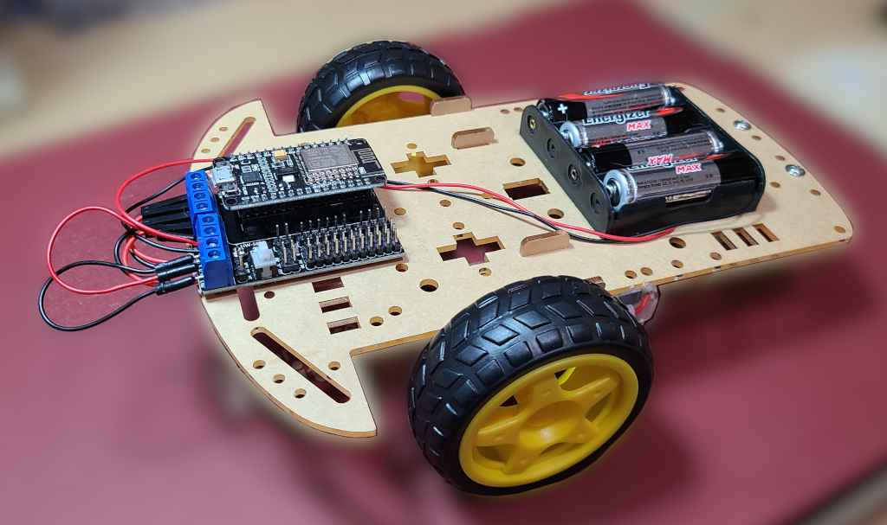
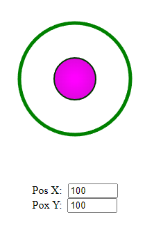
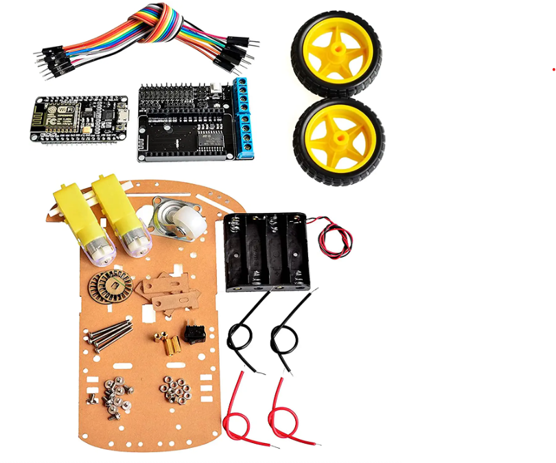
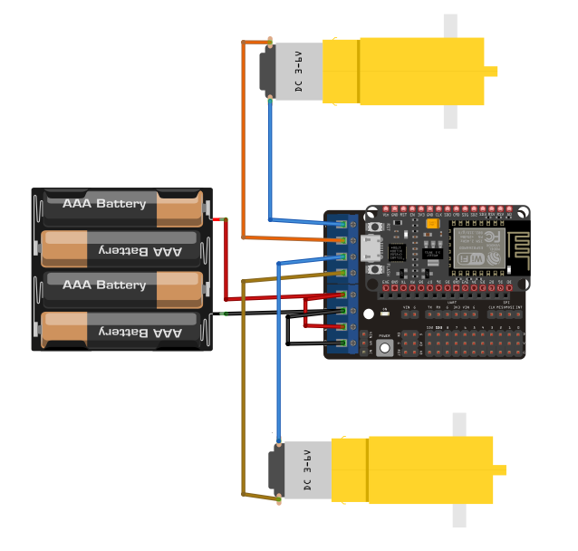

# Websocket server with Joystick for ESP8266

## Finished car

The rc/wifi car can be driven by the between webpage joy stick.  The joystick is served off the ESP8266 using an Asynchronous Web server with websockets for communication.

### Image of web joystick

## Kit from Amazon
[Amazon Link](https://amzn.to/3qbJlMA) </a>

The Arduino code creates a websocket server to allow you to control the robot with a web joystick. 

The motors are controlled using PWM.  

The [L293D](docs/user-mannual-for-esp-12e-motor-shield.pdf) motor shield creates a very compact form factor.  The motor shield was placed on the chasis in order to have easy access to the micro USB port for programming.

The motor shield uses CP210X USB to UART Bridge.  The drivers can be downloaded [here](https://www.silabs.com/developers/usb-to-uart-bridge-vcp-drivers?tab=downloadsg).   

Pin layout for the ESP8266

1) Build the car -- see video.

2) Download the program to the ESP8266
